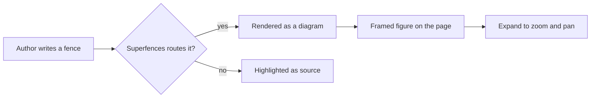
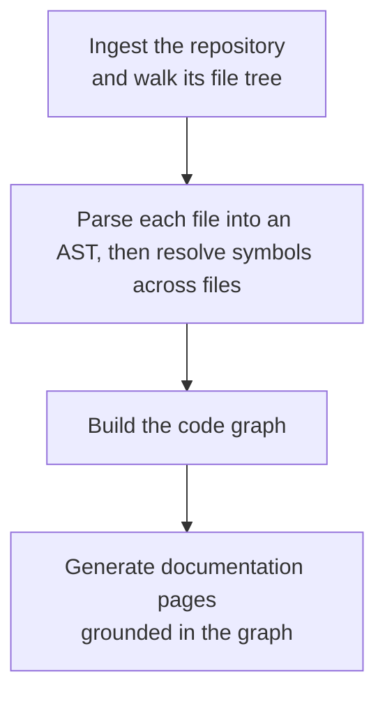
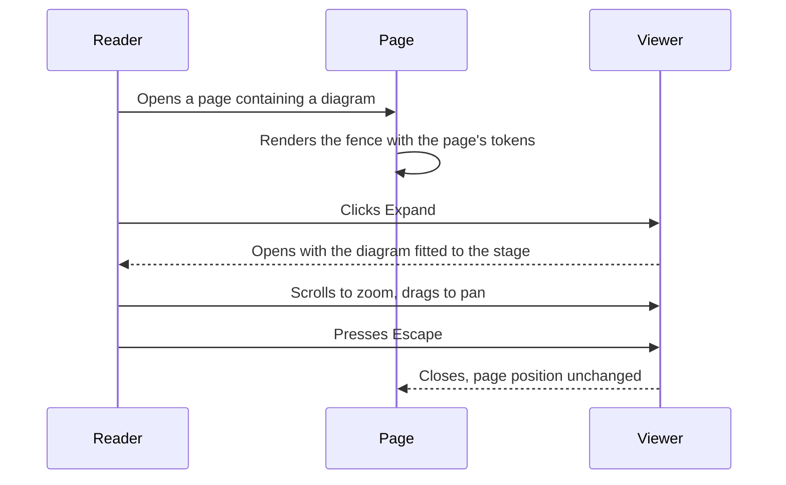
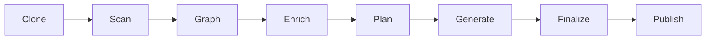
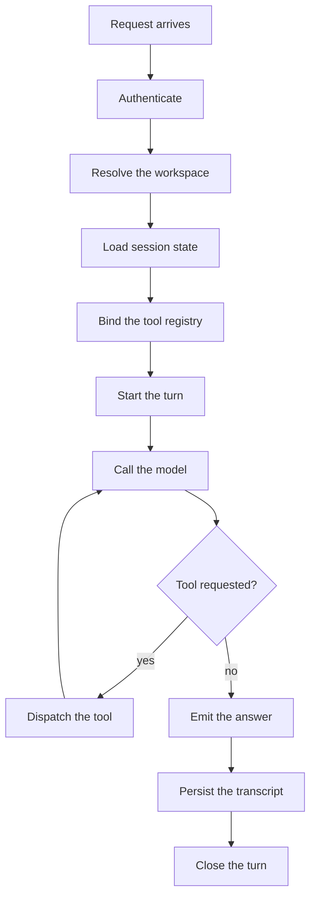
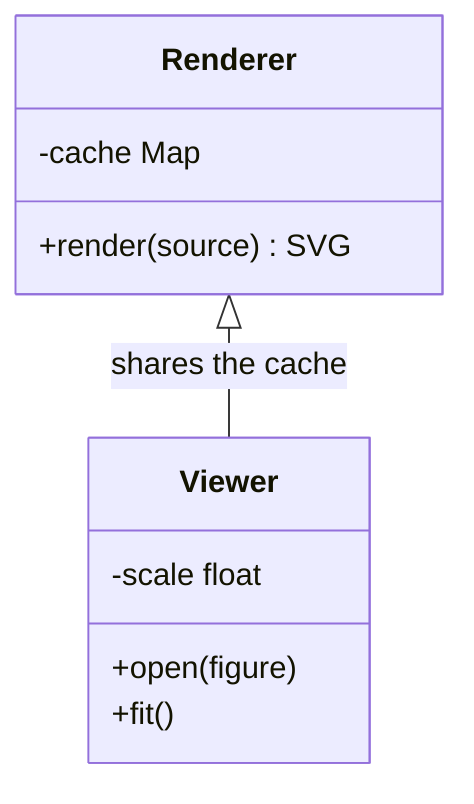
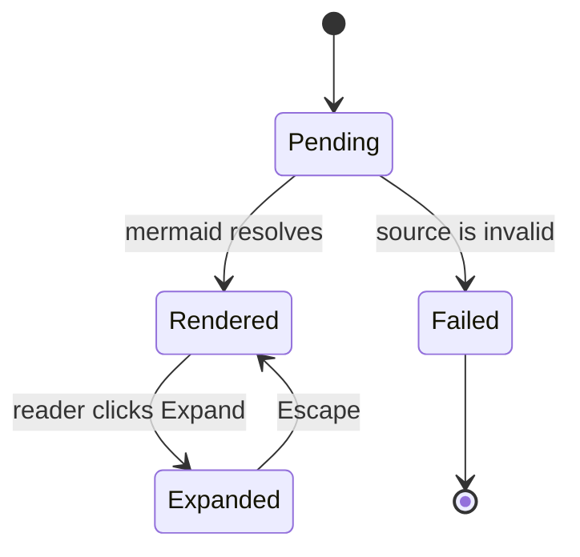

# Mermaid

Fenced ` ```mermaid ` blocks render as diagrams. Each one becomes a framed
figure you can expand: hover it and press **Expand**, or click the figure, to
open a viewer with zoom and pan.

Diagrams are drawn from the site's own colour tokens and typeface, and they
follow the light/dark toggle without a reload.

!!! note "Enabling it"

    The theme ships the renderer, but the fence has to be routed to it by
    `pymdownx.superfences`. Add this to your `mkdocs.yml`:

    ```yaml
    markdown_extensions:
      pymdownx.superfences:
        custom_fences:
          - name: mermaid
            class: mermaid
            format: !!python/name:pymdownx.superfences.fence_code_format
    ```

    Without it a `mermaid` fence is highlighted as plain source and no
    diagram appears.

## Flowchart



## Multi-line labels

Labels wrap onto several lines when they are long, and a `<br/>` forces a
break where you want one. Both are set at the diagram's own leading rather
than the browser default, so a multi-line node sits correctly beside a
single-line one.



## Sequence



## Wide diagrams

A diagram wider than the column is scaled down to fit the figure. Expanding
it restores full size, so nothing is lost to the column width.



## Tall diagrams

A very tall diagram is bounded inside its figure so it cannot push the
surrounding prose apart. The full height is available in the viewer.



## Class diagram



## State diagram


